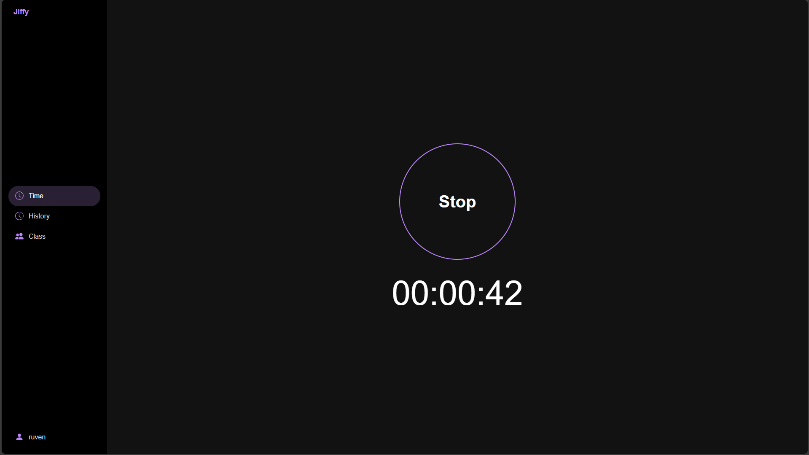
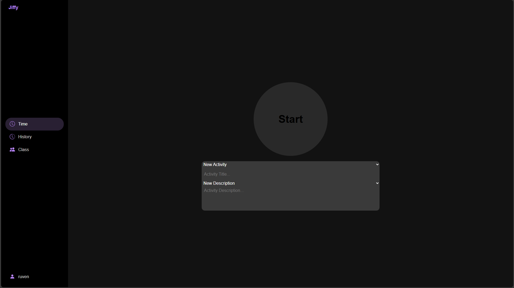

# Jiffy

## English
- [1 API](./docs/en/api.md)

## Deutsch
- [1 Dokumentation](./docs/de/documentation.md)
- [2 Datenmodel](./docs/de/datenmodell.md)
- [3 Abläufe](./docs/de/ablaeufe.md)
- [4 Konventionen](./docs/de/conventions.md)
- [5 API](./docs/de/api.md)

