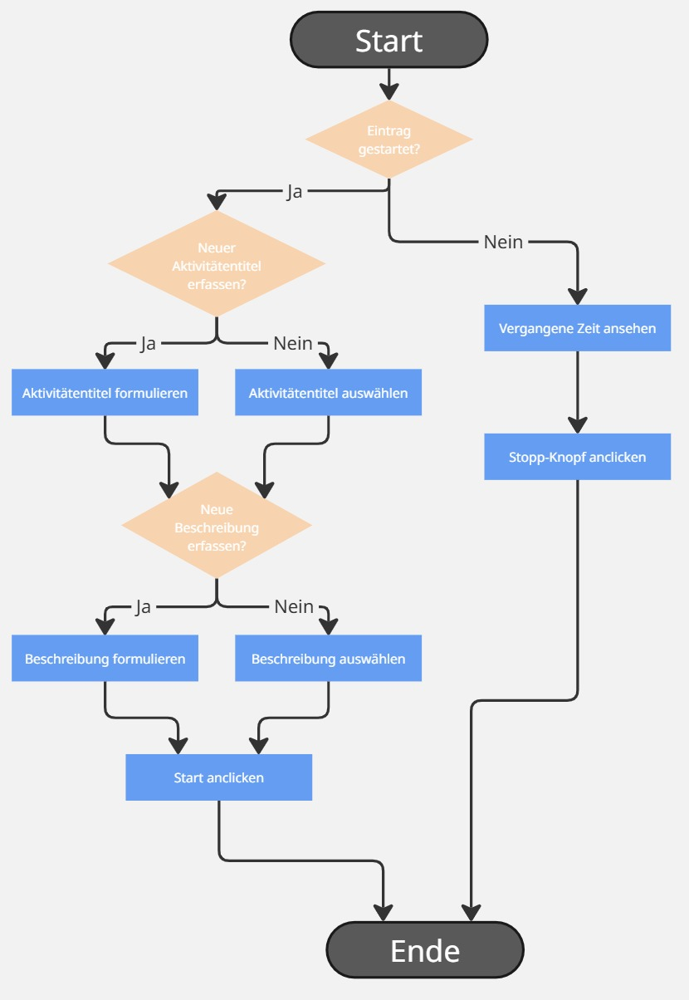

# Inhaltsverzeichnis
- [1 Zeiterfassung](#1-zeiterfassung)

## 1 Zeiterfassung

Wenn ein Nutzer die **Zeiterfassungsseite** aufruft giebt es folgende möglichkeiten:

- **Kein Eintrag gestartet**  
  - Der Nutzer kann einen **Aktivitätstitel** auswählen oder neu erstellen.  
  - Danach wählt oder erstellt er eine **Aktivitätsbeschreibung**.  
  - Mit einem Klick auf **Start** wird der Eintrag gestartet.  

- **Eintrag bereits gestartet**  
  - Der Nutzer sieht die **vergangene Zeit**.  
  - Er hat die Option, den laufenden Eintrag zu **stoppen**.  