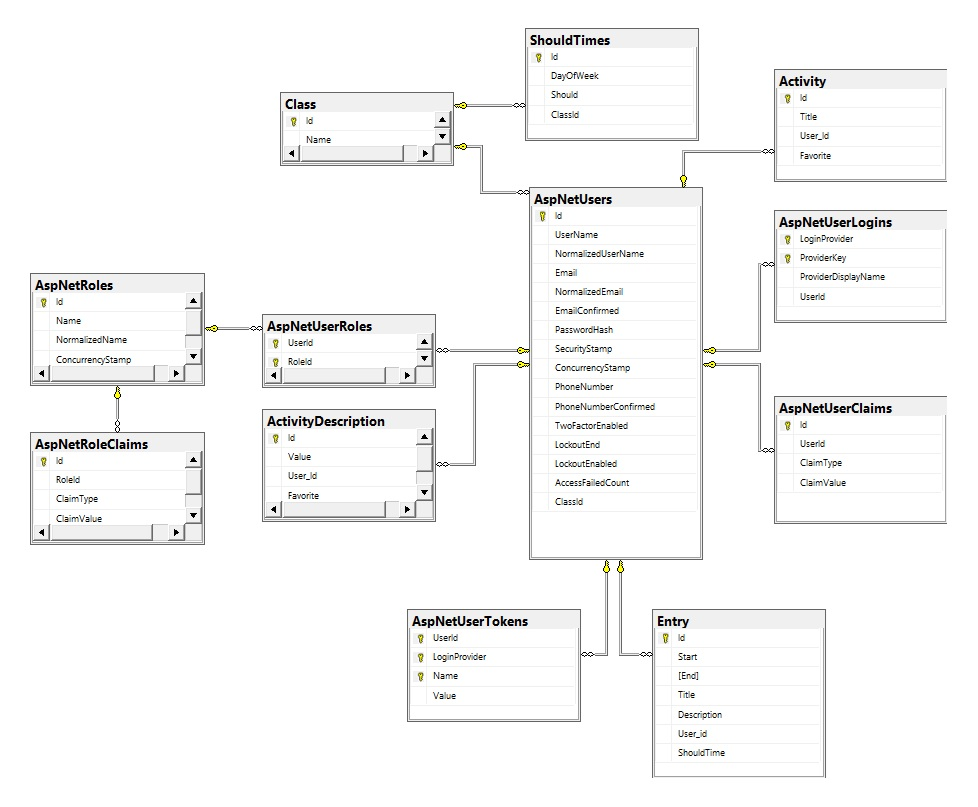

# Inhaltsverzeichnis

- [1 ERD](#1-erd)
- [2 Tabellen](#2-tabellen)
 - [2.1 Framework](#21-framework)
    - [2.1.1 AspNetRoleClaims](#211-aspnetroleclaims)
    - [2.1.2 AspNetRoles](#212-aspnetroles)
    - [2.1.3 AspNetUserClaims](#213-aspnetuserclaims)
    - [2.1.4 AspNetUserLogins](#214-aspnetuserlogins)
    - [2.1.5 AspNetUserRoles](#215-aspnetuserroles)
    - [2.1.6 AspNetUsetTokens](#216-aspnetusettokens)
      - [2.2 Applikation](#22-applikation)
        - [2.2.1 Activity](#221-activity)
        - [2.2.2 ActivityDescription](#222-activitydescription)
        - [2.2.3 Class](#223-class)
        - [2.2.4 Entry](#224-entry)
        - [2.2.5 ShouldTimes](#225-shouldtimes)

# 1 ERD

# 2 Tabellen

## 2.1 Framework

### 2.1.1 AspNetRoleClaims
Speichert Claims, die einer bestimmten Rolle zugeordnet sind.

| Name       | Typ           | Schlüssel   |
|------------|---------------|-------------|
| Id         | int           | Primär      |
| RoleId     | nvarchar(450) | AspNetRoles |
| ClaimType  | nvarchar(MAX) | -           |
| ClaimValue | nvarchar(MAX) | -           |

### 2.1.2 AspNetRoles
Speichert Rollen.

| Name             | Typ           | Schlüssel |
|------------------|---------------|-----------|
| Id               | nvarchar(450) | Primär    |
| Name             | nvarchar(256) | -         |
| NormalizedName   | nvarchar(256) | -         |
| ConcurrencyStamp | nvarchar(MAX) | -         |

### 2.1.3 AspNetUserClaims
Speichert Claims, die einzelnen Benutzern zugewisen sind.

| Name       | Typ           | Schlüssel   |
|------------|---------------|-------------|
| Id         | int           | Primär      |
| UserId     | nvarchar(450) | AspNetUsers |
| ClaimType  | nvarchar(MAX) | -           |
| ClaimValue | nvarchar(MAX) | -           |

### 2.1.4 AspNetUserLogins
**Primärschlüssel:** Kombination aus **LoginProvider** und **ProviderKey**

| Name                | Typ           | Schlüssel   |
|---------------------|---------------|-------------|
| LoginProvider       | nvarchar(450) | Primär      |
| ProviderKey         | nvarchar(450) | Primär      |
| ProviderDisplayName | nvarchar(MAX) | -           |
| UserId              | nvarchar(450) | AspNetUsers |

### 2.1.5 AspNetUserRoles
Speichert die Rollen, die einzelnen Benutzern zugewiesen sind.

**Primärschlüssel:** Kombination aus **UserId** und **RoleId**

| Name   | Typ           | Schlüssel   |
|--------|---------------|-------------|
| UserId | nvarchar(450) | AspNetUsers |
| RoleId | nvarchar(450) | AspNetRoles |

### 2.1.6 AspNetUsetTokens
Speichert Tokens für Benutzer.

**Primärschlüssel:** Kombination aus **UserId**, **LoginProvider** und **Name**

| Name          | Typ           | Schlüssel   |
|---------------|---------------|-------------|
| UserId        | nvarchar(450) | AspNetUsers |
| LoginProvider | nvarchar(450) | -           |
| Name          | nvarchar(450) | -           |
| Value         | nvarchar(MAX) | -           |

## 2.2 Applikation 
### 2.2.1 Activity
Speichert die Aktivitäten der Nutzer.

| Name     | Typ              | Schlüssel   |
|----------|------------------|-------------|
| Id       | uniqueidentifier | Primär      |
| Title    | nvarchar(MAX)    | -           |
| User_Id  | nvarchar(450)    | AspNetUsers |
| Favorite | bit              | -           |

### 2.2.2 ActivityDescription
Speichert die Aktivitäten beschreibungen der Nutzer.

| Name     | Typ              | Schlüssel   |
|----------|------------------|-------------|
| Id       | uniqueidentifier | Primär      |
| Value    | nvarchar(MAX)    | -           |
| User_Id  | nvarchar(450)    | AspNetUsers |
| Favorite | bit              | -           |

### 2.2.3 Class
Speichert alle Klassen

| Name     | Typ              | Schlüssel   |
|----------|------------------|-------------|
| Id       | uniqueidentifier | Primär      |
| Name     | nvarchar(250)    | -           |

### 2.2.4 Entry
Speichert die Einträge der Nutzer.

| Name        | Typ              | Schlüssel |
|-------------|------------------|-----------|
| Id          | uniqueidentifier | Primär    |
| Start       | datetime         | -         |
| End         | datetime         | -         |
| Title       | nvarchar(MAX)    | -         |
| Description | nvarchar(MAX)    | -         |
| User_id     | nvarchar(450)    | -         |
| ShouldTime  | time(7)          | -         |

### 2.2.5 ShouldTimes
Speichert die Soll-Arbeitszeit pro Tag für eine Klasse.

| Name        | Typ              | Schlüssel |
|-------------|------------------|-----------|
| Id          | uniqueidentifier | Primär    |
| DayOfWeek   | int              | -         |
| Should      | time(7)          | -         |
| ClassId     | uniqueidentifier | Class     |