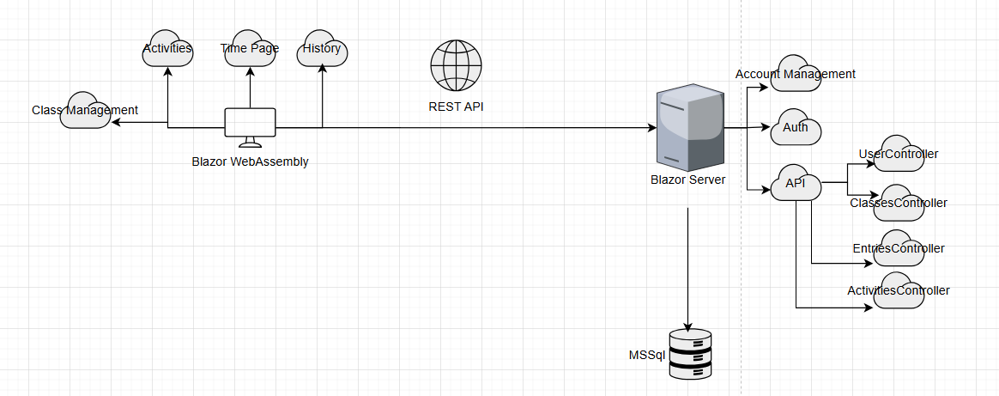

## Zweck
Der Zweck von Jiffy ist es, den Zeitaufschrieb bei der IMS-T zu vereinfachen und die unnötige Komplexität zu vermeiden, die durch zu viele verschiedene, selbst erstellte Excel-Tabellen entstanden ist.

## Anforderungen
1. **Zeiterfassung**
   - Einträge mit Start/Stop prinzip erfassen
2. **Einträge verwalten**
   - Bearbeiten und Löschen von Einträgen.
3. **Aktivitätenbeschreibung**
   - Möglichkeit, detaillierte Beschreibungen zu jedem Eintrag hinzuzufügen.
4. **Zeitübersicht**
   - Anzeige von Über- oder Unterzeiten basierend auf der Täglichen Sollzeit.
5. **Klassenzuordnung**
   - Auswahl der eigenen Klasse.
1. **Aktivitätenverwaltung**
   - Favorisieren, Bearbeiten und Löschen von Aktivitäten.
2. **Klassenmanagement**
   - Erstellen, Bearbeiten und Verwalten von Klassen.
3. **Auswertung**
   - Übersichtliche Darstellung der erfassten Daten zur Kontrolle der Schüler:innen.

## Architekturbeschreibung

